# design-patterns-with-java
This Repo contains a refresher on the most popular design patterns, implemented with a simple set of Java classes

## Table of Contents
- [Creational Patterns](#creational-patterns)
  - [Abstract Factory](#abstract-factory)
  - [Singleton](#singleton)
  - [Factory](#factory)
  - [Builder](#builder)
  - [Prototype](#prototype)
- [Structural Patterns](#structural-patterns)
  - [Adapter](#adapter)
  - [Facade](#facade)
  - [Proxy](#proxy)
  - [Composite](#composite)
  - [Bridge](#bridge)
  - [Flyweight](#flyweight)
  - [Decorator](#decorator)

## Creational Patterns
### Abstract Factory
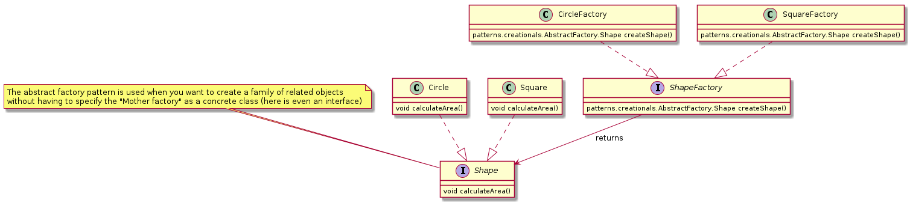

### Singleton
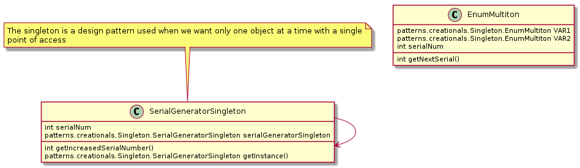

### Factory
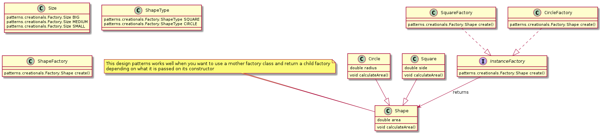

### Builder
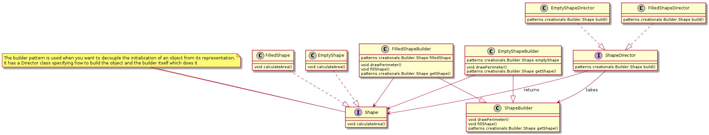

### Prototype
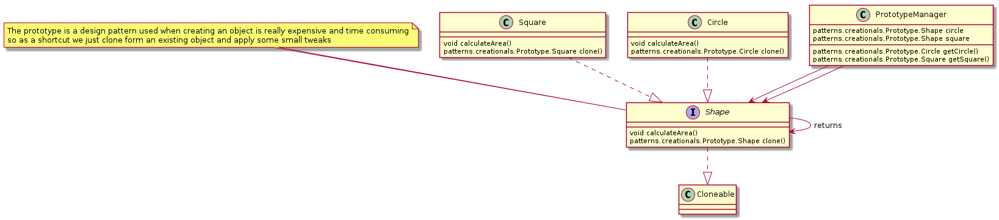

## Structural Patterns
### Adapter
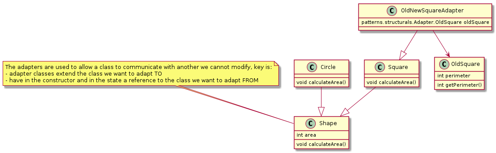

### Facade
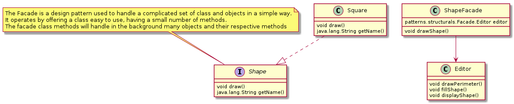

### Proxy
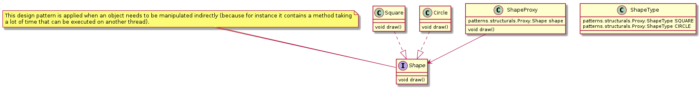

### Composite
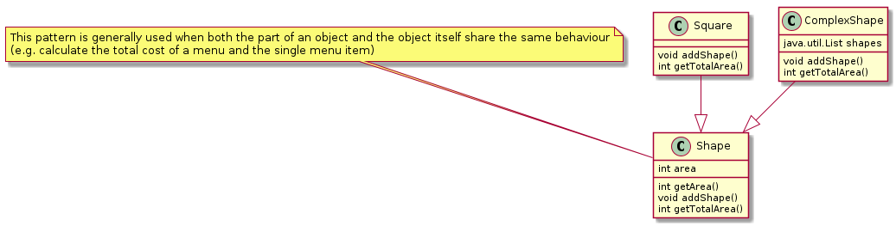

### Bridge
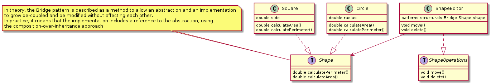

### Flyweight
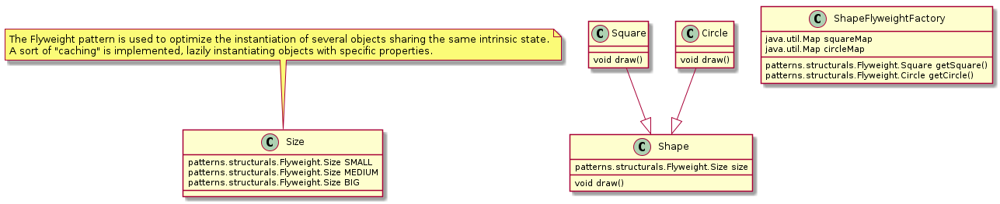

### Decorator
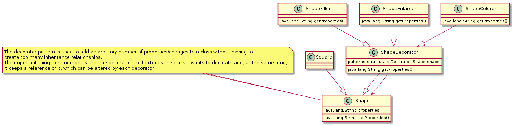