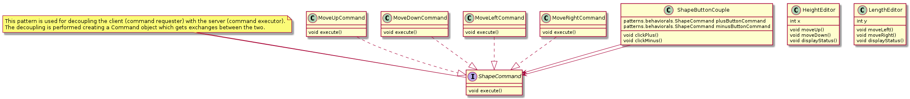
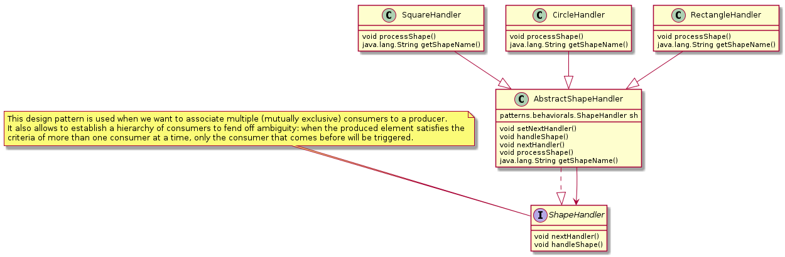
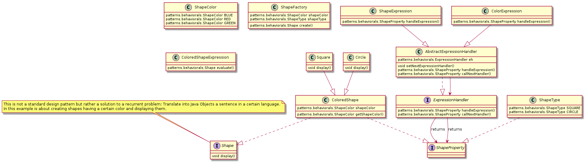
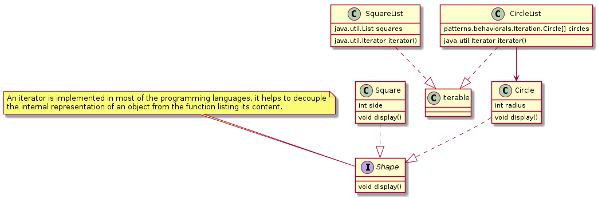
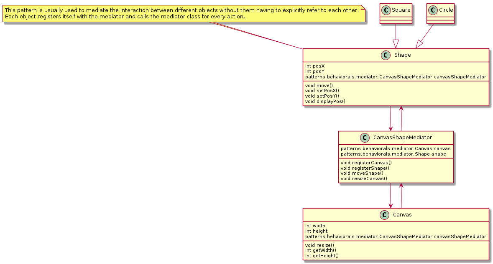
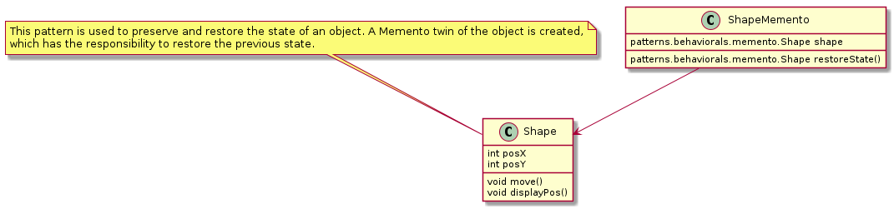
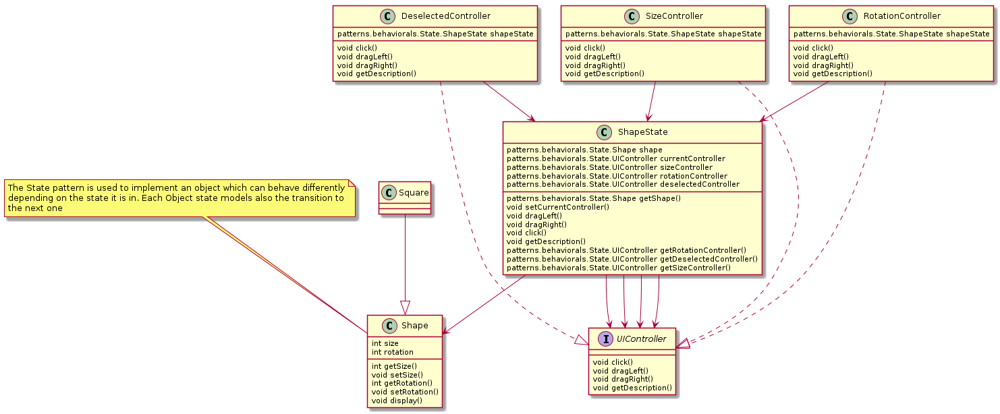
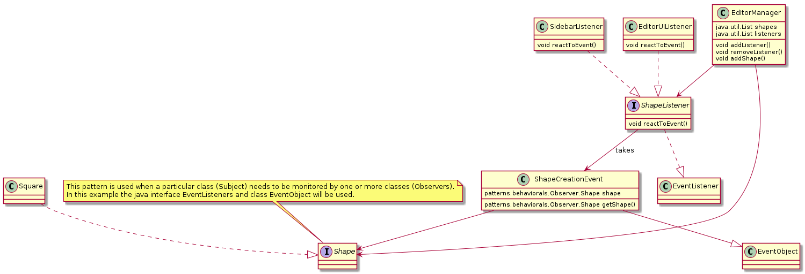
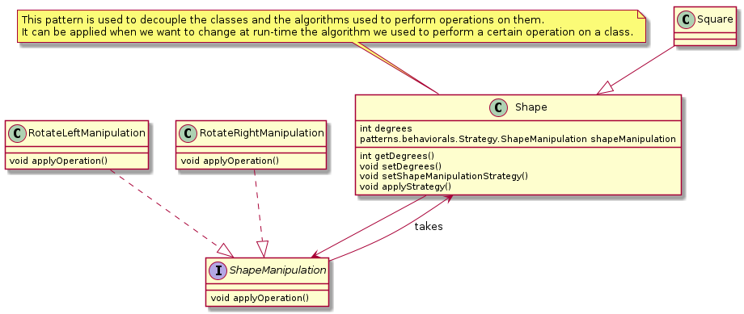
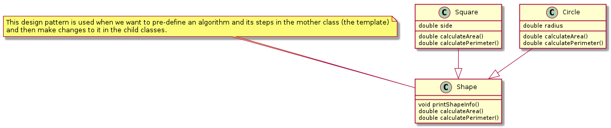

# design-patterns-with-java
This Repo contains a refresher on the most popular design patterns, implemented with a simple set of Java classes

I have been reading [this book](https://www.amazon.de/-/en/Java-Design-Pattern-Essentials-Second/dp/0956575846) and used it as inspiration to come up with my own examples.
My suggestion is to do the same: creating examples in a different domain than those provided by the book, to be sure to catch the gist of each pattern.

The diagrams were drawn by using an automated gradle task that scans every single class in `patterns` and generates the corresponding UML diagram.
Ain't looking pretty, but it is automated ;-)

## Table of Contents
- [Creational Patterns](#creational-patterns)
  - [Abstract Factory](#abstract-factory)
  - [Singleton](#singleton)
  - [Factory](#factory)
  - [Builder](#builder)
  - [Prototype](#prototype)
- [Structural Patterns](#structural-patterns)
  - [Adapter](#adapter)
  - [Facade](#facade)
  - [Proxy](#proxy)
  - [Composite](#composite)
  - [Bridge](#bridge)
  - [Flyweight](#flyweight)
  - [Decorator](#decorator)
- [Behavioral Patterns](#behavioral-patterns)
  - [Command](#command)
  - [Chain of Responsibility](#chain-of-responsibility)
  - [Interpreter](#interpreter)
  - [Iteration](#iteration)
  - [Mediator](#mediator)
  - [Memento](#memento)
  - [State](#state)
  - [Observer](#observer)
  - [Strategy](#strategy)
  - [Template Method](#template-method)
  - [Visitor](#visitor)

## Creational Patterns
### Abstract Factory

### Singleton

### Factory

### Builder

### Prototype

## Structural Patterns
### Adapter

### Facade

### Proxy

### Composite

### Bridge

### Flyweight

### Decorator

## Behavioral Patterns

### Command

### Chain of Responsibility

### Interpreter

### Iteration

### Mediator

### Memento

### State

### Observer

### Strategy

### Template Method

### Visitor
