# Design patterns with Java examples
This Repo contains a refresher on the most popular design patterns, implemented with a simple set of Java classes

I have been reading [this book](https://www.amazon.de/-/en/Java-Design-Pattern-Essentials-Second/dp/0956575846) and used it as inspiration to come up with my own examples.
My suggestion is to do the same: creating examples in a different domain than those provided by the book, to be sure to catch the gist of each pattern.

I also found [this blog post](https://8thlight.com/insights/a-color-coded-guide-to-ports-and-adapters) particularly useful to better describe and understand the clean exagonal architecture.

The diagrams were drawn by using an automated gradle task that scans every single class in `patterns` and generates the corresponding UML diagram.
Ain't looking pretty, but it is automated ;-)

# Table of Contents
- ## [Creational Patterns](#creational-patterns)
  - [Abstract Factory](#abstract-factory)
  - [Singleton](#singleton)
  - [Factory](#factory)
  - [Builder](#builder)
  - [Prototype](#prototype)
- ## [Structural Patterns](#structural-patterns)
  - [Adapter](#adapter)
  - [Facade](#facade)
  - [Proxy](#proxy)
  - [Composite](#composite)
  - [Bridge](#bridge)
  - [Flyweight](#flyweight)
  - [Decorator](#decorator)
- ## [Behavioral Patterns](#behavioral-patterns)
  - [Command](#command)
  - [Chain of Responsibility](#chain-of-responsibility)
  - [Interpreter](#interpreter)
  - [Iteration](#iteration)
  - [Mediator](#mediator)
  - [Memento](#memento)
  - [State](#state)
  - [Observer](#observer)
  - [Strategy](#strategy)
  - [Template Method](#template-method)
  - [Visitor](#visitor)
- ## [BONUS: Exagonal architecture](#exagonal-architecture)

# Creational Patterns
The Creational Patterns are used to control how an object is instantiated.

## Abstract Factory
The abstract factory pattern is used when you want to create a family of related objects
without having to specify the "Mother factory" as a concrete class (here is even an interface).

  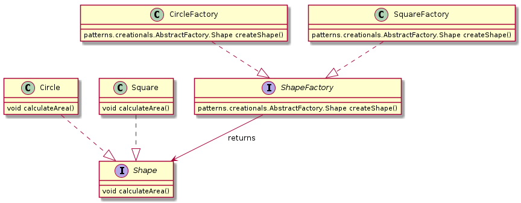

## Singleton
The singleton is a design pattern used when we want only one object at a time with a single
point of access.

  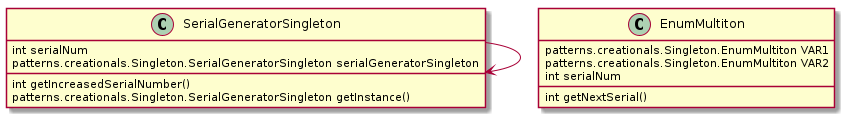

## Factory
This design patterns works well when you want to use a mother factory class and return a child factory
depending on what it is passed on its constructor.

  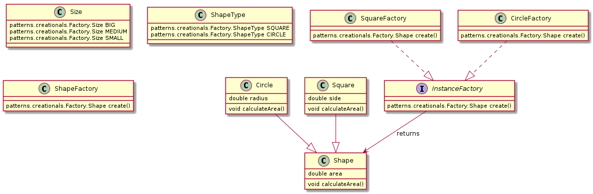

## Builder
The builder pattern is used when you want to decouple the initialization of an object from its representation.
It has a Director class specifying how to build the object and the builder itself which does it.

  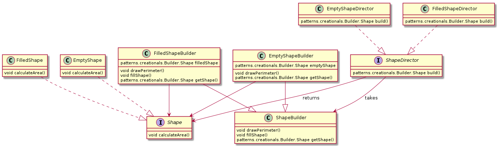

## Prototype
The prototype is a design pattern used when creating an object is really expensive and time-consuming
so as a shortcut we just clone form an existing object and apply some small tweaks.

  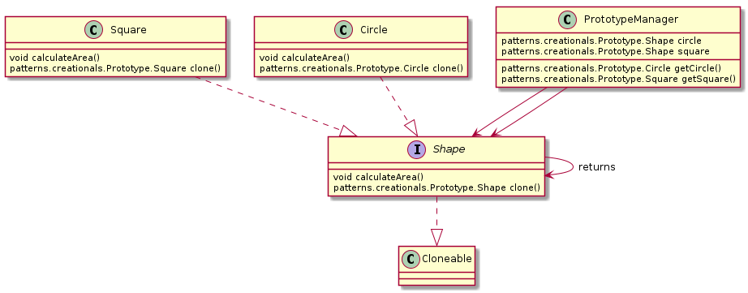

# Structural Patterns
The Structural Patterns are used to control how the classes are related to each other.

## Adapter
The adapters are used to allow a class to communicate with another we cannot modify, key is:
- adapter classes extend the class we want to adapt TO
- have in the constructor and in the state a reference to the class we want to adapt FROM

  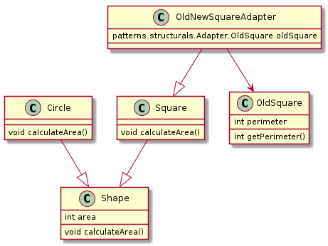

## Facade
The Facade is a design pattern used to handle a complicated set of class and objects in a simple way.
It operates by offering a class easy to use, having a small number of methods.
The facade class methods will handle in the background many objects and their respective methods.

  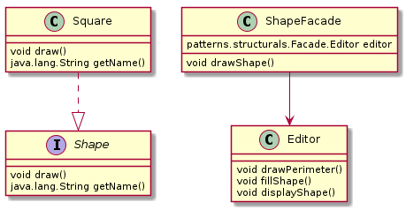

## Proxy
This design pattern is applied when an object needs to be manipulated indirectly (because for instance it contains a method taking
a lot of time that can be executed on another thread).

  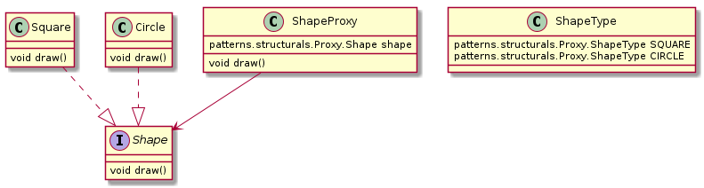

## Composite
This pattern is generally used when both the part of an object and the object itself share the same behaviour
(e.g. calculate the total cost of a menu and the single menu item).

  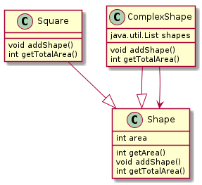

## Bridge
In theory, the Bridge pattern is described as a method to allow an abstraction and an implementation
to grow de-coupled and be modified without affecting each other.
In practice, it means that the implementation includes a reference to the abstraction, using
the composition-over-inheritance approach.

  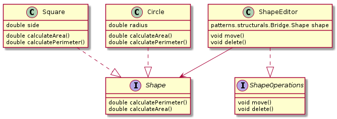

## Flyweight
The Flyweight pattern is used to optimize the instantiation of several objects sharing the same intrinsic state.
A sort of "caching" is implemented, lazily instantiating objects with specific properties.

  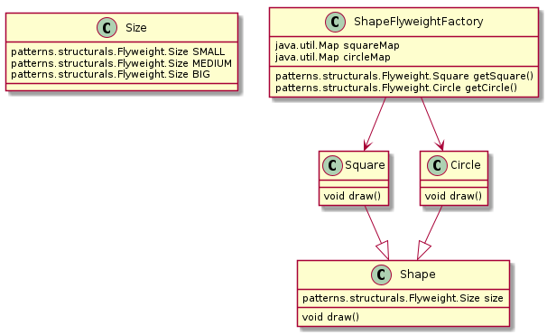

## Decorator
The decorator pattern is used to add an arbitrary number of properties/changes to a class without having to
create too many inheritance relationships.
The important thing to remember is that the decorator itself extends the class it wants to decorate and, at the same time,
It keeps a reference of it, which can be altered by each decorator.

  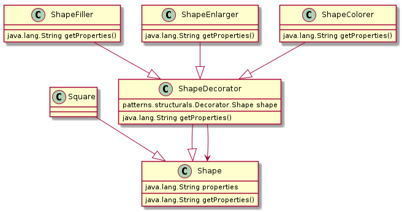

# Behavioral Patterns
The Behavioral Patterns are used to control what the classes exactly do and how they communicate with each other.

## Command
This pattern is used for decoupling the client (command requester) with the server (command executor).
The decoupling is performed creating a Command object which gets exchanges between the two.

  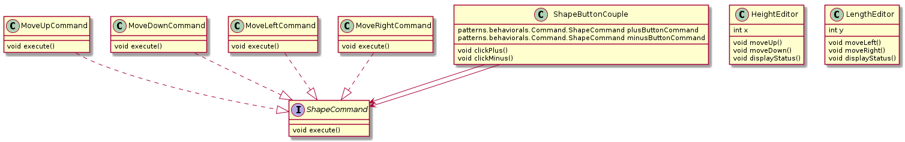

## Chain of Responsibility
This design pattern is used when we want to associate multiple (mutually exclusive) consumers to a producer.
It also allows to establish a hierarchy of consumers to fend off ambiguity: when the produced element satisfies the
criteria of more than one consumer at a time, only the consumer that comes before will be triggered.

  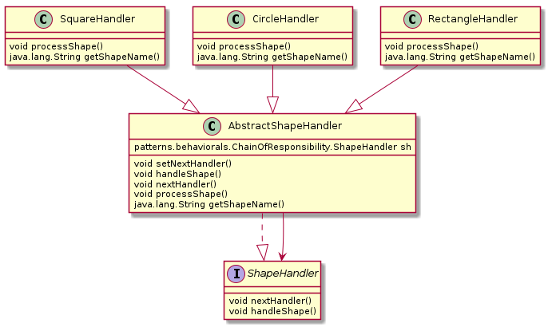

## Interpreter
This is not a standard design pattern but rather a solution to a recurrent problem: Translate into Java Objects a sentence in a certain language.
In this example is about creating shapes having a certain color and displaying them.

  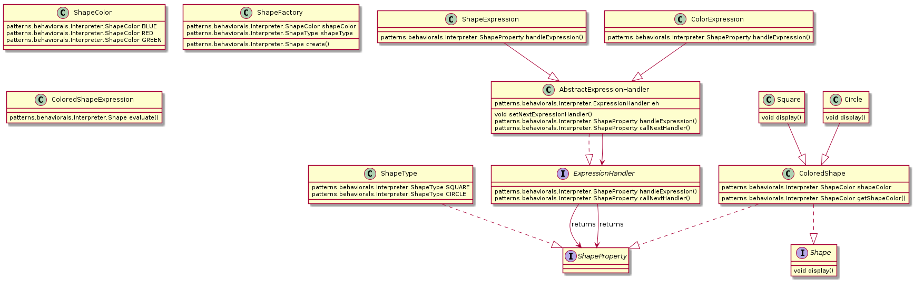

## Iteration
An iterator is implemented in most of the programming languages, it helps to decouple
the internal representation of an object from the function listing its content.

  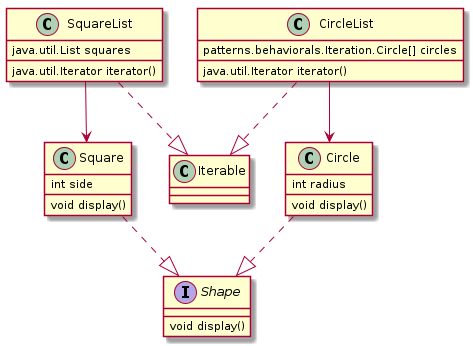

## Mediator
This pattern is usually used to mediate the interaction between different objects without them having to explicitly refer to each other.
Each object registers itself with the mediator and calls the mediator class for every action.

  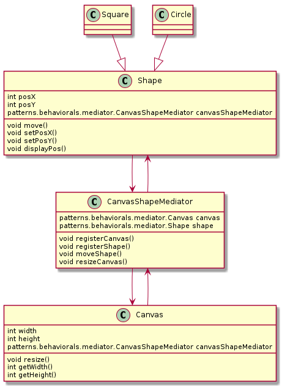

## Memento
This pattern is used to preserve and restore the state of an object. A Memento twin of the object is created,
which has the responsibility to restore the previous state.

  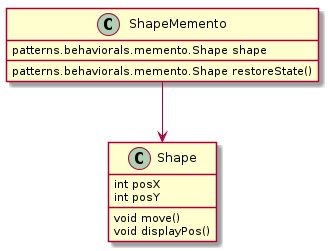

## State
The State pattern is used to implement an object which can behave differently
depending on the state it is in. Each Object state models also the transition to
the next one.

  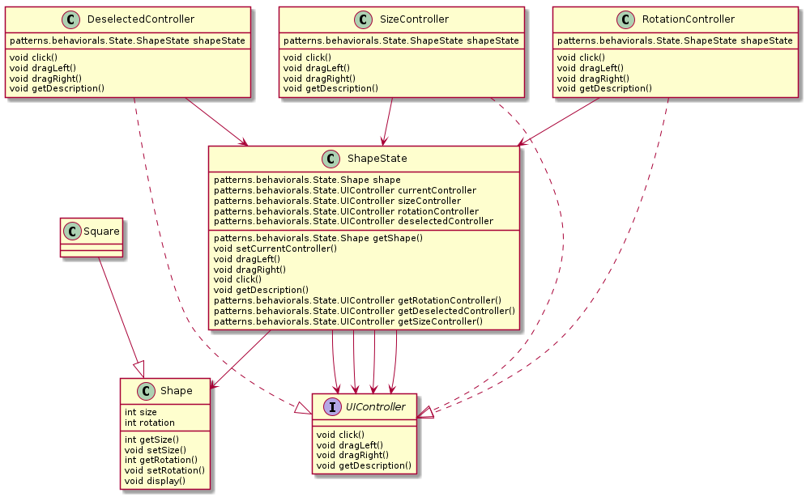

## Observer
This pattern is used when a particular class (Subject) needs to be monitored by one or more classes (Observers).
In this example the java interface EventListeners and class EventObject will be used.

  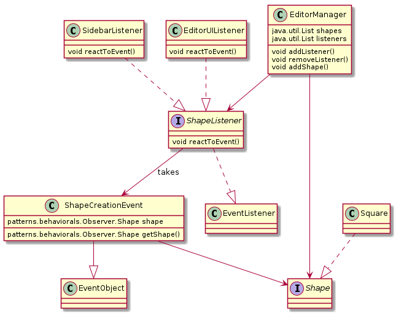

## Strategy
This pattern is used to decouple the classes and the algorithms used to perform operations on them.
It can be applied when we want to change at run-time the algorithm we used to perform a certain operation on a class.

  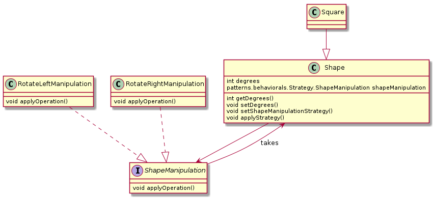

## Template Method
This design pattern is used when we want to pre-define an algorithm and its steps in the mother class (the template)
and then make changes to it in the child classes.

  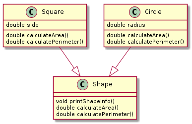

## Visitor
This pattern is used to introduce new functionality into a class hierarchy bringing only a few changes
It consists in adding a Visitor class and a corresponding method to invoke it the visited class.

  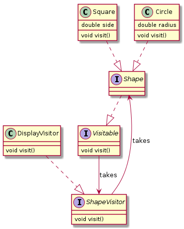

## Exagonal Architecture
The Exagonal architecture can be seen as an evolution of the layered model (controller -> service -> repository).

It inverts the dependency of the service layer (business) with the repository.
In order to achieve this outcome, the architecture will use ports (inbound and outbound) and adapters.

Inbound ports will be IMPLEMENTED by the application, outbound port are those the application DEPENDS on.

  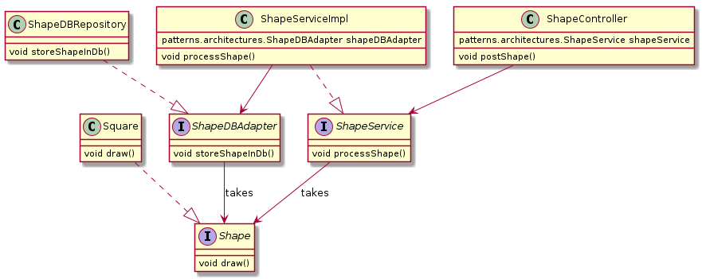

**WHY IS THIS ARCHITECTURE LEANER?** We disengaged the business layer from the concrete implementation of the inbound and outbound ports.
In the future, we can choose to switch the ports and for instance making the outbound port a REST API instead of a DB.
